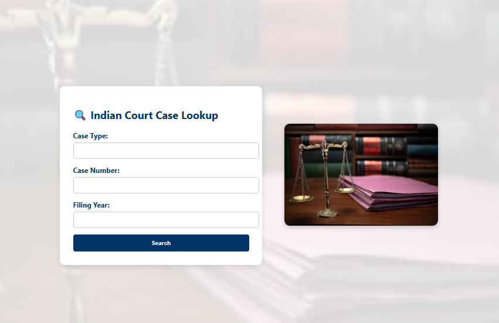

# court-data-fetcher
# Updating the existing README content with a 📸 Screenshots section

updated_readme_with_screenshots = """
# 🏛️ Court-Data Fetcher & Mini-Dashboard

## 🔎 Objective
A lightweight web application to fetch and display Indian court case data including:
- Parties’ names
- Filing & next-hearing dates
- Most recent order/judgment PDF (downloadable)


---

## ⚖️ Court Chosen
**Faridabad District Court**  
🔗 https://districts.ecourts.gov.in/faridabad

---

## 🧪 Functional Requirements Implemented

1. **User Interface**  
   - HTML form with dropdown/input for:
     - Case Type (e.g., CS, CR, etc.)
     - Case Number
     - Filing Year

2. **Backend Scraper**  
   - Sends POST request to Faridabad eCourt portal
   - Bypasses view-state behavior by mimicking browser form requests
   - No CAPTCHA present; no OCR or bypass technique needed
   - Parses the following:
     - Party names
     - Filing date
     - Next hearing date
     - Recent judgment/order PDF link (if available)

3. **Database Logging (SQLite)**  
   - Logs each query (type, number, year)
   - Stores raw HTML response
   - Timestamped logs

4. **Display Output**  
   - Nicely formatted table/card for case metadata
   - Order/judgment PDF: direct download link

5. **Error Handling**
   - Invalid case → "Case not found"
   - Network issues/site down → Friendly message shown

---

## 📸 Screenshots

### 1️⃣ Form Page  
🖼️ *Screenshot of the homepage with form fields: Case Type, Case Number, Filing Year.*

---

### 2️⃣ Case Result Display  
🖼️ *Screenshot showing fetched case details with:  
- Party names  
- Filing date  
- Next hearing date  
- PDF link for recent order*

---

### 3️⃣ Error Handling  
🖼️ *Screenshot showing friendly error message:  
e.g., “No case found” or “Court site unavailable.”*

---

## 🚀 Setup Steps

### Prerequisites
- Python 3.x
- pip

### Installation

```bash
git clone https://github.com/YOUR-USERNAME/court-data-fetcher.git
cd court-data-fetcher
pip install -r requirements.txt
python app.py
